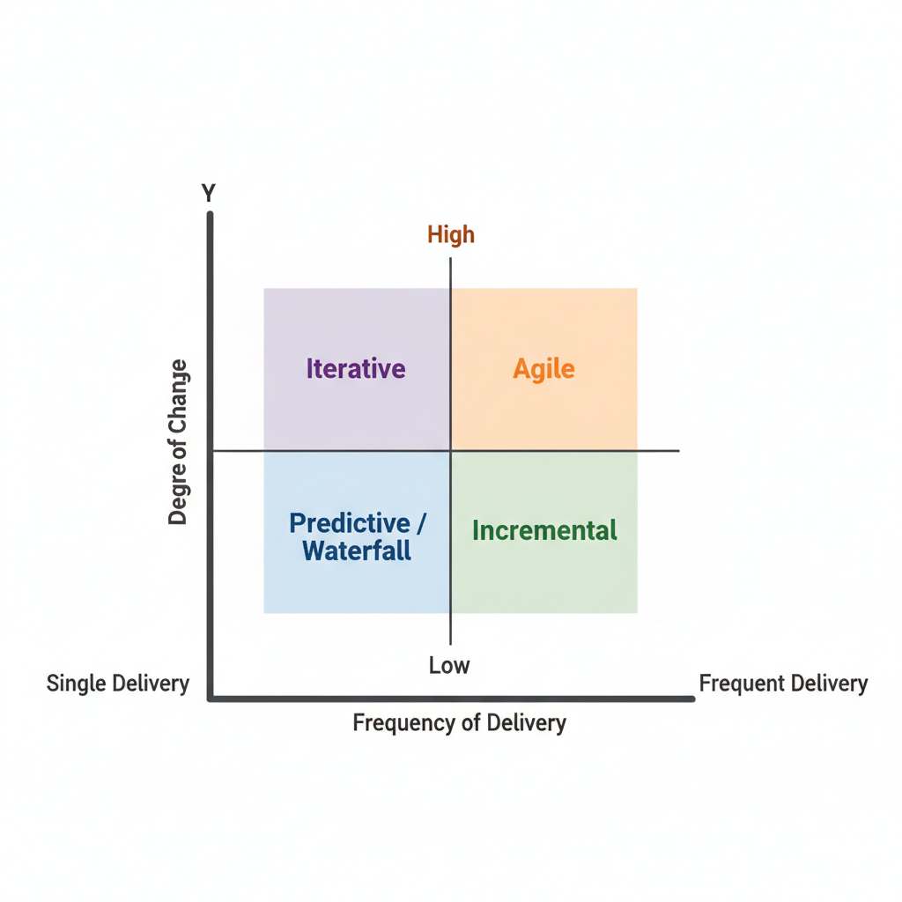

# what is a project?

temporary effort
goal and deliverables
start and end date
clear scope and objectives
specific resources and budget
project have a defined budget
Project: temporary, specific goal, deliverables

agile, responsive to change, focused on specific goals

## project example

Building a new bridge
developing a new software application
renovating a house

risk for project: risky, potential for failure, limited scope

# what is a program?

a program is a collecting of projects, all the individuals projects
multiple projects with interdependencies
large scope than a single project
longer timeline
Program: multiple project, common objective, large scope

efficient, cost-effective, coordination of multiple projects

## program example

A government infrastructure development program
A company's employee training program
A research and development program

risk for program: complex, coordination challenges, longer timeline

# what is a portfolio?

a portfolio is a way to describe the projects in a program, the amount funds and timelines that the organization is willing to invest in the projects
collection of projects, programs and operations that align with strategic objectives
portfolio: collection of work, strategic alignment, broad scope

strategic, alignment with long-term goals, broad scope

risk for portfolio: difficulty in managing and aligning with changing priorities, broad scope

# operation?

operation: ongoing, produce goods or services
operations have ongoing costs

# predictive project

assumption that the future can be accurately predicted based on the past
involves long-term planning to predict future events or outcomes
details plans and budgets
may be less flexible and less able to adapt to unexpected changes

the project you have done in the past, you can predict for the next project based on the past project

construction, Financial planning, Manufacturing
(this all based on the past project)

focus on long-term planning

# predictive approach(just like a waterfall)

phase one: Foundation
Phase two: Framing
Phase three: Interior
Phase four: Landscaping

# Adaptive project

Assumption that the future is uncertain and subject to change
flexible planning and decision-making
ability to adapt to changing circumstances
short-term planning and focus on quick adaptation
may be less efficient and more costly due to frequent adjustments

knowledge works
software dev, marketing, crisis, events
(this project will changed during the project)

focus on short-term

# Adaptive approach(just like a agile, sprint)

more like a circle way to plan and execute the project

# project management life cycle

initiating
planning
executing
monitoring and controlling
closing

during monitoring and controlling, if there is a problem, we go back to planning phase to fix the problem

# define project scope

define the boundaries of a project
outlines what will be included or excluded

# project scope statement

Goals and objectives

# Project risk management

performing qualitative risk analysis(定性風險分析)
 - 快速篩選並排定風險的優先級 low/medium/high
performing quantitative risk analysis(定量風險分析)
 - 用數值來分析這些高優先級風險對專案整體目標（如總成本或總工期）的綜合影響

 # project procurement management
 - 確保專案所需的資源和服務能夠順利取得

# MACD
moving, adding, changing, deleting

